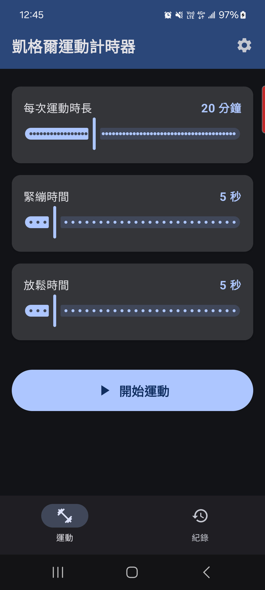
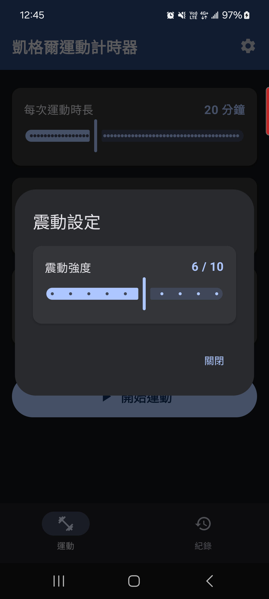
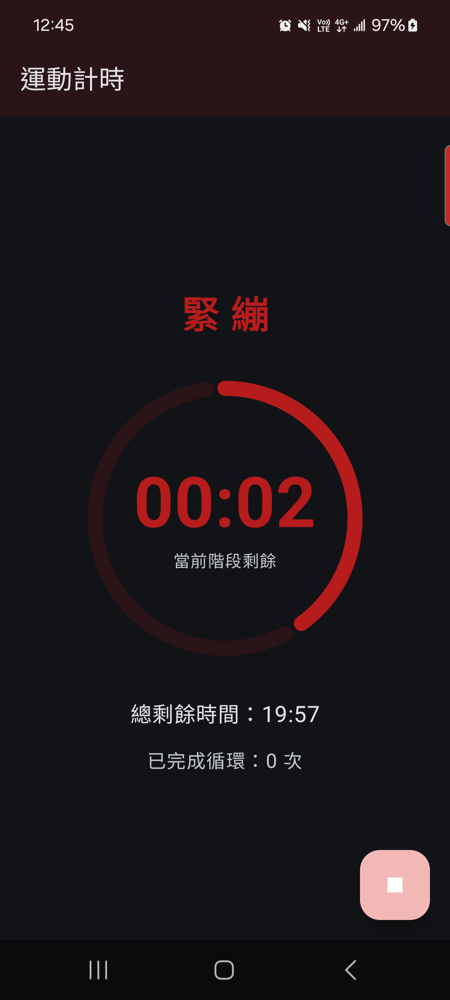
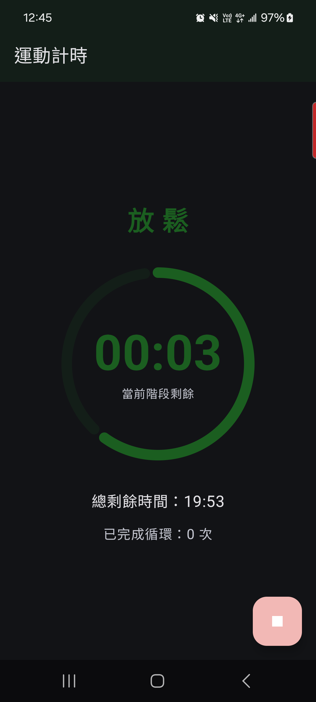
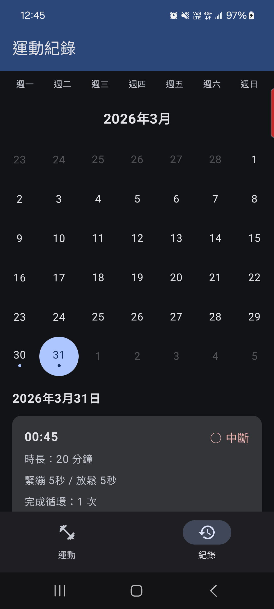

# 凱格爾運動計時器

一款專為凱格爾運動設計的 Android 計時應用，提供可自訂的訓練配置、視覺化倒計時、震動提示，以及完整的運動記錄追蹤功能。

## 截圖

| 主畫面 | 震動設定 | 計時（緊繃） | 計時（放鬆） | 歷史紀錄 |
| :---: | :---: | :---: | :---: | :---: |
|  |  |  |  |  |
| 設定訓練參數 | 震動強度調整 | 緊繃階段倒計時 | 放鬆階段倒計時 | 日曆檢視運動紀錄 |

---

## 功能特色

- **可自訂訓練參數**：運動時長（1–60 分鐘）、緊繃時間（1–30 秒）、放鬆時間（1–30 秒）
- **視覺化倒計時**：圓形進度條隨階段動態切換顏色（紅色緊繃 / 藍色放鬆）
- **多層次震動提示**：強度 1–10 可調，同時控制震動幅度與持續時間
- **背景持續運行**：Foreground Service 確保 App 切到背景時計時不中斷
- **通知顯示**：鎖屏通知即時顯示剩餘時間
- **運動紀錄**：自動儲存每次訓練（完成 / 中斷、完成循環數、配置參數）
- **日曆檢視**：以月曆形式瀏覽歷史紀錄，有紀錄的日期會顯示標記點

---

## 使用流程

```text
主畫面  →  調整訓練設定  →  開始運動
                                ↓
                         計時畫面（緊繃 ↔ 放鬆 循環）
                                ↓
                    運動完成 / 手動停止（紀錄自動儲存）
                                ↓
                         歷史紀錄查詢
```

---

## 技術架構

**Pattern：** MVVM + Repository + Hilt DI

**UI：** Jetpack Compose + Material3

**資料流：**

```text
Composable Screen
      ↕ StateFlow
   ViewModel
      ↕
  Repository
      ↕              ↕
  Room DB       DataStore
(運動紀錄)      (使用者設定)
```

### 主要模組

| 模組 | 說明 |
| --- | --- |
| `ui/screen/home/` | 主畫面：設定訓練參數、震動強度 |
| `ui/screen/timer/` | 計時畫面：倒計時、階段切換動畫 |
| `ui/screen/history/` | 歷史紀錄：日曆視圖 + 紀錄卡片 |
| `service/TimerService.kt` | Foreground Service，管理計時邏輯與通知 |
| `util/VibrationHelper.kt` | 封裝震動 API，支援強度分級 |
| `util/NotificationHelper.kt` | 訓練中通知 + 完成通知 |
| `data/db/` | Room 資料庫（ExerciseRecord） |
| `data/preferences/` | DataStore 使用者偏好設定 |
| `di/AppModule.kt` | Hilt 依賴注入設定 |

---

## 環境需求

| 項目 | 版本 |
| --- | --- |
| Min SDK | Android 12（API 31） |
| Target SDK | Android 15（API 35） |
| Kotlin | 2.0.21 |
| Compose BOM | 2024.12.01 |
| Gradle | 8.13.2 |

---

## 建置方式

```bash
# Clone 專案
git clone <repo-url>
cd KegelExercise

# Debug APK
./gradlew assembleDebug

# Release APK
./gradlew assembleRelease

# Lint 檢查
./gradlew lint
```

> 需要在 `local.properties` 設定 Android SDK 路徑（此檔案不進版控）：
>
> ```properties
> sdk.dir=/path/to/Android/Sdk
> ```

---

## 權限說明

| 權限 | 用途 |
| --- | --- |
| `VIBRATE` | 階段切換與完成時的震動反饋 |
| `FOREGROUND_SERVICE` | 背景計時不中斷 |
| `POST_NOTIFICATIONS` | 顯示訓練中 / 完成通知 |
| `REQUEST_IGNORE_BATTERY_OPTIMIZATIONS` | 避免系統終止背景服務 |

---

## 授權

本專案僅供個人學習與使用。
